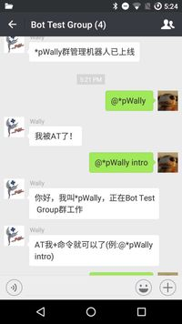
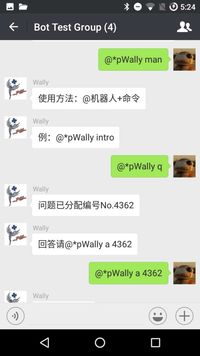
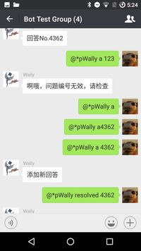
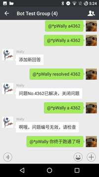

# Wechat Group Manager

## Usage
> @RobotName command [arguments]

## Commands

| Command Names | Function                            | Arguments        | Example         |
|---------------|-------------------------------------|------------------|-----------------|
| intro         | ask the robot to introduce itself   | None             | `@Robot intro`  |
| man*          | manual                              | None            | `@Robot man`    |
| faq**         | frequently asked questions          | None             | `@Robot faq`    |
| q             | ask question in the group           | None or question | `@Robot q`      |
| a             | answer a question or add new answer | question number  | `@Robot a 1338` |
| r             | question resolved, close            | question number  | `@Robot r 1338` |
<pre>
* to be improved
** to be completed
</pre>

## Result

## Contributing
  * New feature suggestions is welcome in repository [issues](https://github.com/WallyYang/WechatGroupManager/issues), please include detailed description of how the new feature works.
  * Contributing your code, either fix bug, or implement new features(discuss in issues first), is welcome through fork & pull request.

## License
This software is licensed under the [GPL v3 license](https://www.gnu.org/copyleft/gpl.html).
